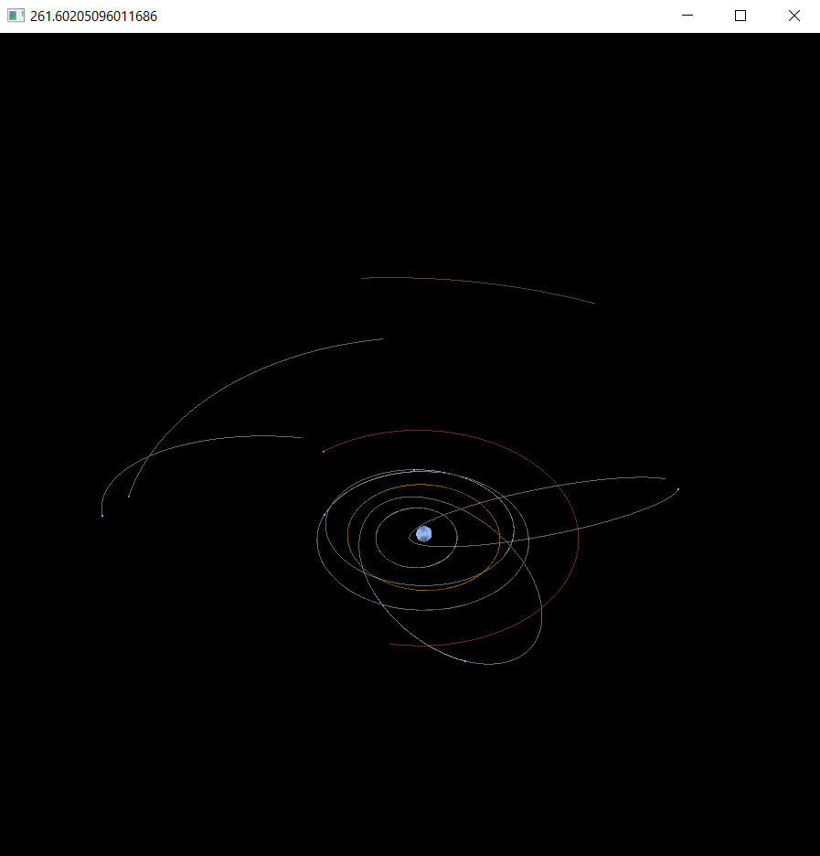

# Solar System N-Body Simulation & Transfer Orbit Planner

This project is a real-time 3D N-body simulation of the inner Solar System with an integrated Lambert transfer solver for launching a spacecraft between bodies.  
It combines:

- OpenGL visualization  
- Adaptive Dormand–Prince numerical integration  
- Real-time simulation control  
- Procedurally generated ephemerides  
- Interplanetary trajectory planning  

The result is an interactive tool that simulates orbital mechanics and visualizes spacecraft transfers using locally generated ephemeris data.
 
> This repository is a **refactored and reorganized version of an earlier personal project**.  
> Focusing on improving the presentation.

---

## Showcase

<p align="center" width="100%">
     
     
</p>

## Features

### **N-Body Physics**
- Sun, Earth, Mars (extendable to more bodies)
- Gravitational interaction modelled using Newtonian gravity
- Accurate positions and velocities when comparing with reputable ephemerides
- Adaptive Dormand–Prince integration for stability in areas of high curvature

### **Interplanetary Transfer Planning**
- Lambert transfer calculation using self-generated ephemerides
- Interpolated target-state selection for mission planning
- Launch handling from Earth to Mars
- Propagation of spacecraft in the N-body system after burn

### **Procedural Ephemerides**
- All body motion is generated directly from the simulation
- Each timestep is logged to CSV traces
- Lambert solver uses generated ephemeris data instead of external libraries

### **OpenGL Visualization**
- 3D rendering of celestial bodies 
- Orbit trails
- Free-fly camera (WASD, mouse look, scroll zoom)
- Adjustable simulation scaling

### **Time Management**
- Adaptive physics timestep based on numerical error
- Rendering framerate independent from physics (as much as possible)
- Simulation time advances based on error, not frame delta

---

## Controls

| Key | Action |
|-----|--------|
| **<kbd>W</kbd><kbd>A</kbd><kbd>S</kbd><kbd>D</kbd>** | Move camera |
| <kbd>**Space</kbd> / <kbd>Ctrl**</kbd> | Move camera up/down |
| <kbd>**Mouse Move**</kbd> | Look around |
| <kbd>**Scroll Wheel**</kbd> | Zoom |
| <kbd>**R**</kbd> | Start / pause simulation |
| <kbd>**L**</kbd> | Trigger spacecraft launch |
| <kbd>**Up</kbd>   <kbd>Down**</kbd> | Adjust orbital scale |
| <kbd>**Esc**</kbd> | Save integration data & exit |

---
<!-- @import "[TOC]" {cmd="toc" depthFrom=1 depthTo=6 orderedList=false} -->

<!-- code_chunk_output -->

- [Solar System N-Body Simulation & Transfer Orbit Planner](#solar-system-n-body-simulation--transfer-orbit-planner)
  - [Showcase](#showcase)
  - [Features](#features)
    - [**N-Body Physics**](#n-body-physics)
    - [**Interplanetary Transfer Planning**](#interplanetary-transfer-planning)
    - [**Procedural Ephemerides**](#procedural-ephemerides)
    - [**OpenGL Visualization**](#opengl-visualization)
    - [**Time Management**](#time-management)
  - [Controls](#controls)
  - [Project Structure](#project-structure)
  - [Numerical Considerations](#numerical-considerations)
  - [Possible Future Improvements](#possible-future-improvements)
  - [Referenced Methods / Data](#referenced-methods--data)
  - [License](#license)

<!-- /code_chunk_output -->


##  Project Structure

```
Solar-System-Integrator/
│
├── app/
│   ├── main.py              # Init
│   └── application.py       # Main event loop & control logic, couldn't find a way to split this up nicely
│
├── engine/
│   ├── shader.py            # Shader wrapper
│   ├── sphere.py            # Sphere mesh 
│   ├── camera.py            # Camera movement
│   └── colors.py            # Color dictionary
│
├── simulation/
│   ├── body.py              # Body class, data organisation & logging
│   ├── integrators.py       # DP integrators
│   ├── load_bodies.py       # Load initial state from CSV
│   ├── lambert.py           # Lambert targeting & interpolation
│   └── transferorbit.py     # Spacecraft launch model, very weird but cool implementation I suppose
│
└── data/
    ├── body_data.csv        # Physical constants, see here for what bodies can be loaded
    ├── simulation_results/  # Generated logs
    └── traces/              # Ephemeris traces for Lambert's Problem
```

---

## Numerical Considerations

This simulation is accurate for visualization and rough mission planning, but it includes a few limitations:

The Lambert solver uses the simulation’s own logged ephemeris instead of analytic or NASA SPICE data. This can cause small inconsistencies compared to high-precision ephemerides.
Mainly the fact that there is a large number of cases for which a launch target vector may land between two discrete points on the ephemerides, requiring a sort of interpolation. Even then,
due to the nature of lambert's problem, the spacecraft must be isolated to a 2-body system, leaving it out of the error computation for the adaptive timestep. This is most noticable
in high-curvature situations such as a trajectory that passes nearby the sun.

---

## Possible Future Improvements

- Use an accurate reference ephemerides  
- Add more useful visualisation tools
- Implement trajectory correction maneuvers, essentially live spacecraft controls
- Add UI controls or initial start GUI so you don't have to tweak values in the code
- Add more interesting bodies 
- Offloading computations to the GPU would be natural, Numpy vectorisation on the CPU does a good job for a relatively low number of bodies

---

## Referenced Methods / Data

- Izzo(2015) Lambert's problem algorithm  
- NASA Planetary Fact Sheets  (+JPL Horizons)

---

## Dependencies

- **numpy**
- **pandas**
- **PyGLM** (glm)
- **PyOpenGL**
- **PyOpenGL_accelerate** (optional but recommended)
- **glfw**
- **pywin32** (Windows only, used for `win32api`)
- **poliastro**
- **astropy**
- **scipy** (required by poliastro)
- **lamberthub**
- **csv** (standard library)
- **datetime** (standard library)
- **bisect** (standard library)
- **pathlib** (standard library)
- **os** (standard library)
- **cProfile** (standard library, optional)
- **pstats** (standard library, optional)

---

## License

Do whatever you want with this repo.